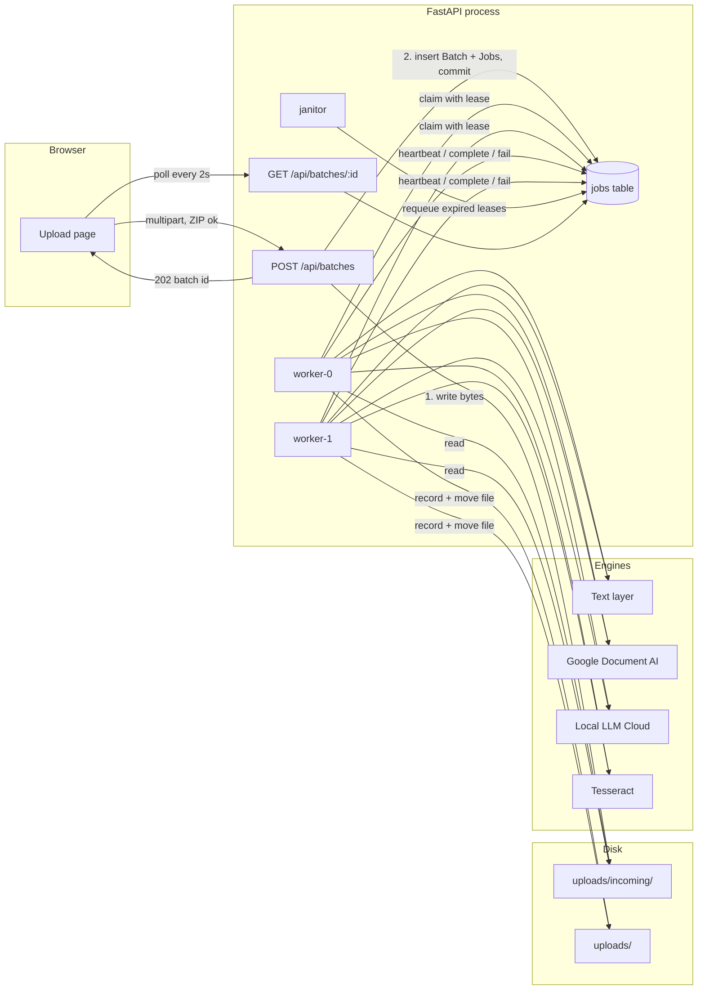
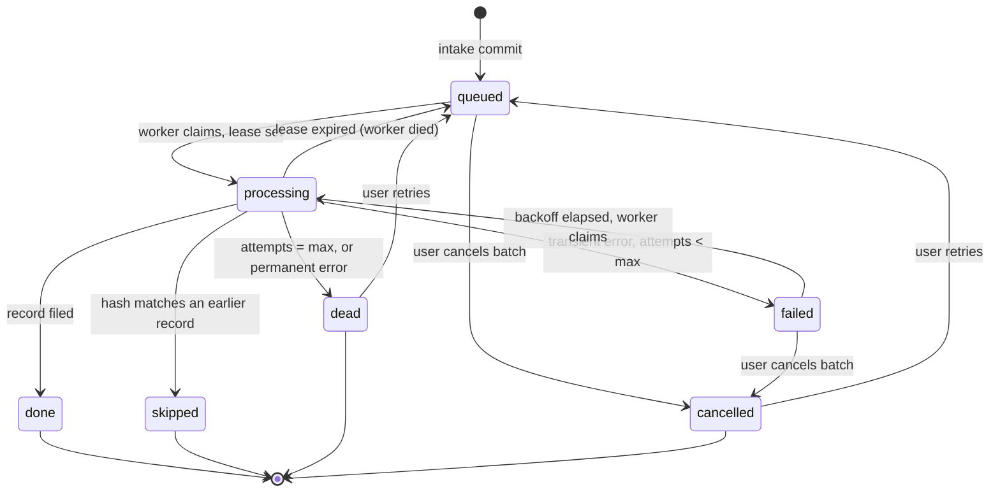
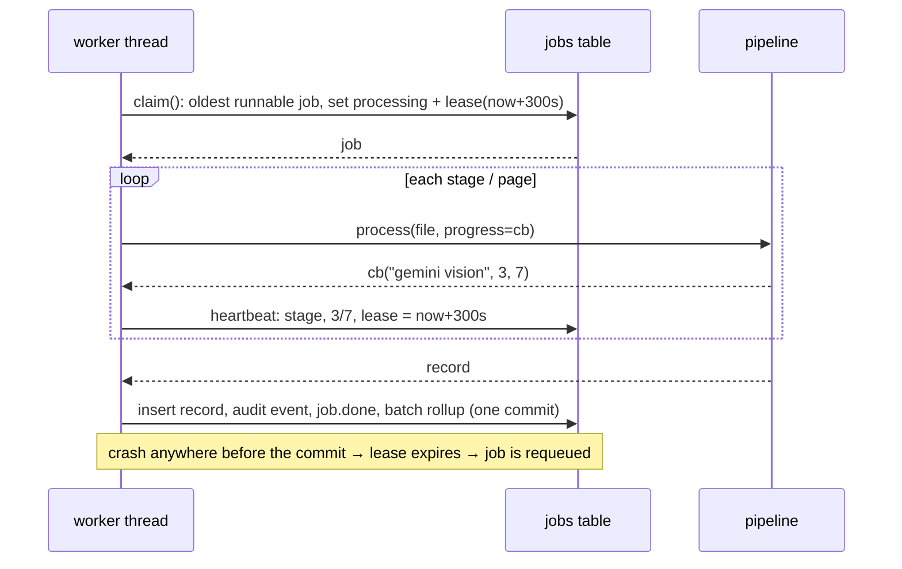

# Bulk upload architecture

The goal: a registrar drops a folder of two thousand transcripts, walks away, and comes back to find every single one
either filed as a record or listed with a reason it could not be. No file is lost, no page is skipped, and a crash or
restart in the middle changes nothing except timing.

## 1. Shape of the system



Three roles live in one process today. They are separable: the intake endpoint and the status endpoint are stateless
HTTP; the workers only need the database and the `uploads/` directory. Section 6 covers scaling them apart.

## 2. Intake: durable before acknowledged

`POST /api/batches` accepts any number of files, including ZIP archives and whole folders (the browser sends a folder
as a flat list of files with relative paths).

1. ZIPs are expanded in memory. Members that are not a supported type (`.DS_Store`, `__MACOSX/`, stray `.xyz`) are
   dropped; limits on entry count and total bytes stop zip bombs.
2. Every file is hashed (SHA-256) and written to `uploads/incoming/<batch>-<uuid>.<ext>`.
3. One `Batch` row and one `Job` row per file are inserted, then **committed in a single transaction**.
   If anything fails before the commit, the written files are deleted and the client gets an error, so a batch is
   all-or-nothing.
4. The endpoint returns `202 Accepted` with the batch id. Only now does the browser consider the upload done.

Because step 2 precedes step 3 and step 3 is atomic, there is no window where a job row exists without its bytes, or
bytes exist that no row refers to for longer than a failed request.

Duplicates inside one batch (same hash) are marked `skipped` at intake. Duplicates of files filed in **earlier**
batches are detected by the worker and pointed at the existing record, so re-uploading a folder never creates twins.

## 3. The job state machine



| State | Meaning | Terminal |
| --- | --- | --- |
| `queued` | On disk, waiting for a worker | no |
| `processing` | A worker holds a lease on it | no |
| `failed` | Attempt failed; will retry after backoff (15s, 30s, 60s …) | no |
| `done` | Record created; file moved to the permanent store | yes |
| `skipped` | Identical bytes were already filed; points at that record | yes |
| `dead` | Gave up after `JOB_MAX_ATTEMPTS`, or the file itself is unreadable | yes |
| `cancelled` | User cancelled before it ran | yes |

**Permanent vs transient.** An unsupported file type or a corrupt PDF will not get better with retries and goes
straight to `dead`. A rate-limited LLM call, a network blip, or a busy database is transient and retries with
exponential backoff. The distinction is made where the error is raised (`IngestError.status`), not by guessing.

## 4. Workers: claim, lease, heartbeat



- `claim()` takes the oldest job whose state is `queued`, or `failed` with its backoff elapsed. On SQLite the claim is
  serialised with a process lock so two threads cannot take the same row. On Postgres this becomes
  `SELECT … FOR UPDATE SKIP LOCKED` and works across processes and machines.
- A **lease** (`lease_expires_at`) is set on claim and renewed on every heartbeat. The pipeline reports progress per
  stage and, for the vision model, per page, so a 40-page scan keeps renewing its lease while it works.
- The **janitor** thread runs every `lease / 2` seconds and requeues any `processing` job whose lease has expired.
  The same sweep runs at startup, so a hard kill mid-batch just costs one retry.
- Completion is one transaction: record, subjects, audit row, job status and batch rollup commit together. Either the
  file is filed and the job says so, or neither happened.

## 5. "Without missing any part"

Three levels of completeness are enforced:

1. **Every file.** A batch is `completed` only when `count(queued) + count(processing) + count(failed) = 0`. The
   rollup is recomputed from the jobs table on every transition, never incremented, so it cannot drift.
   If any job is `dead` the batch is `attention` instead, and the UI offers a one-click retry of exactly those.
2. **Every page.** The text-layer reader walks every page. The vision engine renders every page and sends each in
   its own request; `progress_done / progress_total` shows `3/7 pages` in the UI, and a partial run never produces a
   record, it fails the attempt.
3. **Every field.** Record-level extraction confidence and the Verified / Needs review stamp are unchanged; a job can
   be `done` and still need a human look. That is a data-quality signal, not a pipeline failure.

What can still go wrong, and what happens:

| Failure | Outcome |
| --- | --- |
| API process crashes during intake | No commit, so no batch. Client gets a network error and resubmits. Orphan files in `incoming/` are cleaned by the failed-request handler or a periodic sweep. |
| Worker thread dies mid-file | Lease expires (≤ 5 min); janitor requeues; another worker retries. |
| Whole process restarts | Startup sweep requeues everything that was `processing`. Queue continues. |
| Cloud engine outage | Attempts fail with backoff; after 3 the jobs are `dead`. Fix the outage, click "Retry failed". |
| Disk full | Intake fails atomically; nothing half-written. |
| Same folder uploaded twice | Second batch's jobs become `skipped` pointing at the first batch's records. |
| User closes the browser | Irrelevant. The batch exists server-side from the 202 onward. |

## 6. Scaling out

The single-process design runs comfortably to a few thousand files a day. When it is time to grow:

- **Database:** swap the SQLite URL for Postgres. `claim()` becomes `FOR UPDATE SKIP LOCKED`; everything else is
  plain SQLAlchemy.
- **Workers as separate processes:** run `python -m app.worker_main` on N machines pointed at the same database and a
  shared `uploads/` (NFS, or S3 with the paths swapped for keys). The API stops starting its own pool. The lease and
  janitor logic already assumes workers may be anywhere.
- **Concurrency per engine:** Local LLM Cloud is rate-limited per API key, so keep `WORKER_CONCURRENCY` low (1 to 2) for
  scan-heavy batches, or add a per-engine semaphore. Text-layer batches can run 8+ wide on one box.
- **Live updates:** the UI polls every 2 seconds, which is cheap and works through any proxy. If you need push,
  put a Server-Sent Events endpoint over the same batch query; nothing in the workers changes.
- **Observability:** every transition writes `stage`, `attempts`, `worker_id` and timestamps on the job row. Batch
  uploads, retries and cancellations go to the FERPA audit log. Point a dashboard at
  `GET /api/batches/summary` for queue depth and dead-letter count.

## 7. Endpoints

| Method | Path | Purpose |
| --- | --- | --- |
| POST | `/api/batches?mode=auto&name=` | multipart `files[]` (ZIP and folders ok); returns 202 + batch |
| GET | `/api/batches` | list batches, newest first |
| GET | `/api/batches/summary` | queue depth, processing, dead count, worker count |
| GET | `/api/batches/{id}` | batch with per-state counts (poll this) |
| GET | `/api/batches/{id}/jobs?status=` | per-file rows with stage, progress, error, record link |
| POST | `/api/batches/{id}/retry` | requeue every dead job |
| POST | `/api/batches/{id}/cancel` | cancel jobs that have not run yet |
| POST | `/api/jobs/{id}/retry` | requeue one job |

## 8. Where the code lives

```
backend/app/services/queue.py   intake, claim/lease/heartbeat, rollup, retry, cancel
backend/app/worker.py           thread pool, janitor, per-job processing, lifecycle
backend/app/services/ingest.py  bytes -> Record (shared with single upload)
backend/app/services/pipeline.py engine selection, now with progress callbacks
backend/app/routers/batches.py  HTTP surface
frontend/src/pages/Batches.tsx   drop zone, batch list, queue summary
frontend/src/pages/BatchDetail.tsx per-file table, stacked progress bar, retry / cancel
```
